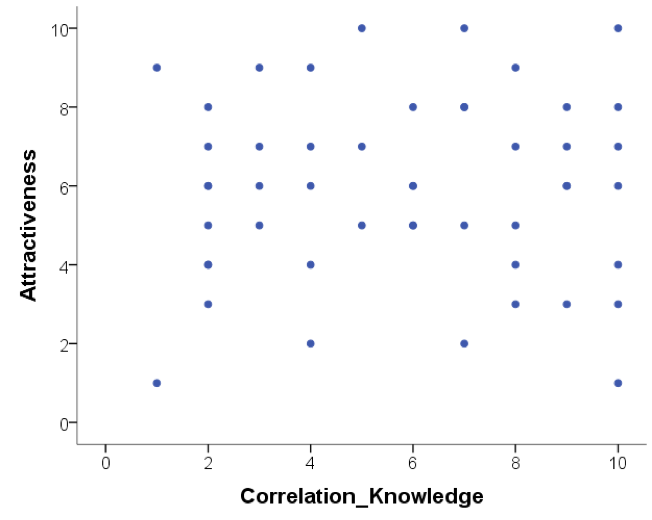
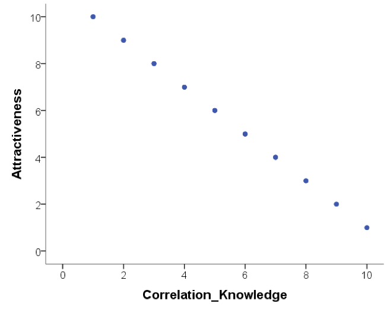

---
output:
  html_document: default
  pdf_document: default
---


```{r eval=FALSE, include=FALSE}
library(tidyverse)
load("tidy_data.RData")

# set up the data for Task 3
data %>% 
  select(home_location, uk_salary) %>% 
  write_csv("data_salary.csv")

```

# Week 11: Correlation

> Written by Margriet Groen (partly adapted from materials developed by the PsyTeachR team a the University of Glasgow)

Today we will take a look at correlation as a measure of association between two numerical variables. We will create scatterplots to visualise correlations, we will run a correlation analysis and we will practise interpreting and reporting the results.

## Lectures
The lecture material for this week is presented in two parts:

1. [**Theory**](https://web.microsoftstream.com/video/6cff8539-a25a-43b7-9647-403f14539276) 
Watch this part before you complete the reading and the pre-lab activities.

2. [**How to**](https://web.microsoftstream.com/video/974ed3d4-ec1c-45f4-b63a-a7ff86a8d12a)
Watch this part either after the 'Theory' part of after you've completed the pre-lab activities 1 to 3. Definitely watch it before you come to your lab session.

## Reading
The reading that accompanies the lectures this week and next week is from [**the free textbook by Miller and Haden**](https://drive.google.com/file/d/0B1fyuTuvj3YoaFdUR3FZaXNuNXc/view).

Chapter 10 gives you a brief overview of what correlation and regression are. Chapter 11 introduces correlation in more detail. Both chapters are really short but provide a good basis to understanding correlational analysis. Please note, in Chapter 10 you might encounter some terminology that is unfamiliar to you. It talks about ANOVA, which means Analysis of Variance and about GLM, which means General Linear Model. Having a quick look at Chapter 1 of Miller and Haden also helps with that.

## Pre-lab activities
After having watched the lectures on correlation and read the textbook chapters you’ll be in a good position to try these activities. Completing them before you attend your lab session will help you to consolidate your learning and help move through the lab activities more smoothly.

### Pre-lab activity 1: Visualing correlations
Have a look at [**this visualisation of correlations**](https://rpsychologist.com/correlation/) by Kristoffer Magnusson.

After having read Miller and Haden Chapter 11, use this visualisation page to visually replicate the scatterplots in Figures 11.3 and 11.4 - use a sample of 100. After that, visually replicate the scatterplots in Figure 11.5. 

Each time you change the correlation, pay attention to the shared variance (the overlap between the two variables) and see how this changes with the changing level of relationship between the two variables. The greater the shared variance, the stronger the relationship.
Also, try setting the correlation to r = .5 and then moving a single dot to see how one data point, a potential outlier, can change the stated correlation value between two variables.

### Pre-lab activity 2: Guess the correlation
Now that you are well versed in interpreting scatterplots (scattergrams) have a go at [**this online app on guessing the correlation**](https://www.rossmanchance.com/applets/GuessCorrelation.html). 

This is a very basic app that allows you to see how good you are at recognising different correlation strengths from the scatterplots. We would recommend you click the “Track Performance” tab so you can keep an overview of your overall bias to underestimate or overestimate a correlation.

Is this all just a bit of fun? Well, yes, because stats is actually fun, and no, because it serves a purpose of helping you determine if the correlations you see in your own data are real, and to help you see if correlations in published research match with what you are being told. As you will have seen from the above examples, one data point can lead to a misleading relationship and even what might be considered a medium to strong relationship may actually have only limited relevance in the real world. One only needs to mention Anscombe’s Quartet to be reminded of the importance of visualising your data, which leads us to the final pre-lab activity for this week.

### Pre-lab activity 3: Anscombe's quartet
Anscombe (1973) showed that four sets of bivariate data (X, Y) that have the exact same means, medians, and relationships can look very different when plotted. You can read more about this [**here**](https://en.wikipedia.org/wiki/Anscombe%27s_quartet).

All in this is a clear example of why you should visualise your data and not to rely on just the numbers.

### Pre-lab activity 4: Getting ready for the lab class
#### Remind yourself of the basics of how to work with RStudio.
You might want to re-watch some of the videos John and Tom provided in PSYC121:

* [Video on how to upload a zip file and import data (3.5 mins)](https://dtu-panopto.lancs.ac.uk/Panopto/Pages/Viewer.aspx?id=646a4bd4-9b2e-46a1-b2ee-adc100ce507b)
* [Video on basic operations in RStudio (8 mins)](https://dtu-panopto.lancs.ac.uk/Panopto/Pages/Viewer.aspx?id=646a4bd4-9b2e-46a1-b2ee-adc100ce507b)
* [Video on using scripts and using the console (3 mins)](https://web.microsoftstream.com/video/dcf3165c-86e7-4546-96d8-0ca6f56cbd7d)

#### Create a folder and a Project for Week 11.
[Click here for the instructions](https://tombeesley.github.io/PSYC121_2021-22/week-6-visualising-data-and-binomial-tests.html#creating_project) from Week 6 of PSYC121 if you are unsure.

#### Get your files ready
Download the [week11.zip](files/week11/week11_forStudents.zip) file and upload it into the new folder in RStudio Server you created at the previous step. If you need them, [here are the instructions](https://tombeesley.github.io/PSYC121_2021-22/week-2-descriptive-statistics-in-r-studio.html#uploading_zip) from Week 2 of PSYC121.

## Lab activities
In this lab, you’ll gain understanding of and practice with:

* constructing and interpreting scatterplots
* running correlation analysis and interpret the results
* reporting the results in APA format
* constructing a correlation matrix in APA format
* when and why to apply correlation analysis to answers questions in psychological science

### Lab activity 1: Interpreting correlation

#### Question 1
Below are scatterplots that show the relationship between ‘how much you know about correlation and how attractive you appear to members of the opposite (&/or same) sex’.
Choose the type of correlation (strength and direction) displayed in each graph using one of the following:

* Perfect positive correlation
* Perfect negative correlation
* Strong positive correlation
* Strong negative correlation
* Moderate positive correlation
* Moderate negative correlation
* Null correlation

**Figure A** 

**Figure B**

**Figure C**

**Figure D**


#### Question 2
Suppose it was observed that there is a correlation of r = -.81 between a driver’s age and the cost of car insurance. This correlation would mean that, in general, older people pay more for car insurance.

**TRUE or FALSE? Explain why.**

*Note: explain your chosen answer based on the statistic given, not on why you think the correlation may or may note make 'logical' sense*).

#### Question 3
Suppose that there is a correlation of r = .87 between the length of time a person is in prison and the amount of aggression the person displays on a psychological inventory administered at release. This means that spending a longer amount of time in prison *causes* people to become more aggressive. 

**TRUE or FALSE? Explain why.**

#### Question 4
A significant correlation was found between having great hair and performance in correlation labs. The correlation coefficient was .7. How much variance in correlation lab performance can the ‘greatness’ of your hair explain?

*	51%
*	70%
* 49%
* 30%
* Who cares I’ve got great hair.

What was the reason for your answer?

What is this ‘new coefficient’ called?

### Lab activity 2: Visualising, calculating and reporting correlations


## Answers

When you have completed all of the lab content, you may want to check your answers with our completed version of the script for this week. **Remember**, looking at this script (studying/revising it) does not replace the process of working through the lab activities, trying them out for yourself, getting stuck, asking questions, finding solutions, adding your own comments, etc. **Actively engaging** with the material is the way to learn these analysis skills, not by looking at someone else's completed code...

The answer script will be available after the final lab session has taken place.