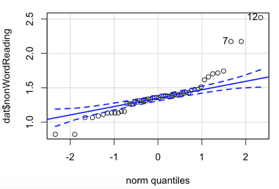
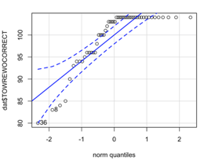
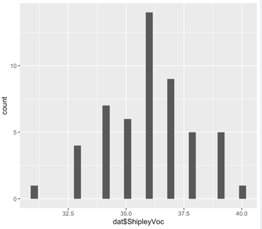
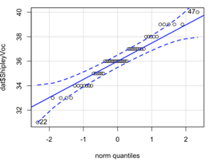

---
output:
  html_document: default
  pdf_document: default
---

# Week 12: Correlation 2

> Written by Margriet Groen (partly adapted from materials developed by the PsyTeachR team a the University of Glasgow)

Today we will continue a look at correlation as a measure of association between two numerical variables. We will review assumptions associated with correlation, discuss some issues important to be aware of when interpreting correlation results and finally, we'll talk about intercorrelation.

## Lectures
The lecture material for this week is presented in two parts:

1. [**Correlation -- Assumption, issues and intercorrelation -- Theory**](https://web.microsoftstream.com/video/ba2545ce-100f-4390-9094-928e88ffd527) 

2. [**Correlation -- Assumption, issues and intercorrelation -- How to**](https://web.microsoftstream.com/video/7d8c5ec1-c45d-4bca-8dce-02777ee3ecea)

## Reading
The reading that accompanies the lectures this week is (the same as last’s week) from [**the free textbook by Miller and Haden**](https://drive.google.com/file/d/0B1fyuTuvj3YoaFdUR3FZaXNuNXc/view).

**Chapter 10** gives you a brief overview of what correlation and regression are. **Chapter 11** introduces correlation in more detail. Both chapters are really short but provide a good basis to understanding correlational analysis. Please note, in Chapter 10 you might encounter some terminology that is unfamiliar to you. It talks about ANOVA, which means Analysis of Variance and about GLM, which means General Linear Model. Having a quick look at Chapter 1 of Miller and Haden also helps with that.

## Pre-lab activities
After having watched the lectures on correlation and read the textbook chapters you’ll be in a good position to try these activities. Completing them before you attend your lab session will help you to consolidate your learning and help move through the lab activities more smoothly.

### Pre-lab activity 1: Online interactive tutorial to practise your data-wrangling skills

Data comes in lots of different formats. One of the most common formats is that of a two-dimensional table (the two dimensions being rows and columns). Usually, each row stands for a separate observation (e.g. a participant), and each column stands for a different variable (e.g. a response, category, or group). A key benefit of tabular data is that it allows you to store different types of data-numerical measurements, alphanumeric labels, categorical descriptors-all in one place.

It may surprise you to learn that scientists actually spend far more of time cleaning and preparing their data than they spend actually analysing it. This means completing tasks such as cleaning up bad values, changing the structure of tables, merging information stored in separate tables, reducing the data down to a subset of observations, and producing data summaries. Some have estimated that up to 80% of time spent on data analysis involves such data preparation tasks (Dasu & Johnson, 2003)!

Many people seem to operate under the assumption that the only option for data cleaning is the painstaking and time-consuming cutting and pasting of data within a spreadsheet program like Excel. We have witnessed students and colleagues waste days, weeks, and even months manually transforming their data in Excel, cutting, copying, and pasting data. Fixing up your data by hand is not only a terrible use of your time, but it is error-prone and not reproducible. Additionally, in this age where we can easily collect massive datasets online, you will not be able to organise, clean, and prepare these by hand.

In short, you will not thrive as a psychologist if you do not learn some key data wrangling skills. Although every dataset presents unique challenges, there are some systematic principles you should follow that will make your analyses easier, less error-prone, more efficient, and more reproducible.

In the online tutorial, you will see how data science skills will allow you to efficiently get answers to nearly any question you might want to ask about your data. By learning how to properly make your computer do the hard and boring work for you, you can focus on the bigger issues.

You’ll be practising the `select()`, `filter()`, `mutate()`, `arrange()`, `group_by()` and `summarise()`  functions from the dplyr package.

You’ve used these functions before, but if you’d like to quickly remind yourself what they do, watch the video (~10 min) on [**Data wrangling: dplyr and pipes**](https://web.microsoftstream.com/video/900227ea-714e-4c58-b8b1-5fdc8cc76140). As the title suggests, I also explain in the video what a ‘pipe’ (this thing: `%>%`) is and you’ll be practising with that as well. 

If you’re ready to begin, go to the tutorial linked to below. There is no need to install or download anything. Each tutorial has everything you need to write and run R code, right in the tutorial.

* [**Working with Tibbles**](https://rstudio.cloud/learn/primers/2.1) Practise how to extract values form a table, subset tables, calculate summary statistics, and derive new variables.

### Pre-lab activity 2: Getting ready for the lab class

#### Get your files ready
Download the [122_week12_forStudents.zip](files/week12/122_week12_forStudents.zip) file and upload it into the new folder in RStudio Server you created (see last week's Pre-lab activity 4 for instructions on how to do that.

## Lab activities
In this lab, you’ll gain understanding of and practice with:

*	constructing and interpreting histograms and qq-plots
*	constructing and interpreting a matrix of scatterplots
*	running intercorrelation analysis and interpret the results
*	correct for multiple comparisons when running intercorrelation analysis
*	constructing a correlation matrix in APA format
*	when and why to apply correlation analysis to answers questions in psychological science

### Lab activity 1: Assumptions of Correlation Analysis

#### Question 1
Correlation would be an appropriate form on analysis for researchers interested in the relationship between
a.	Dog (breed) and height (cm) of owner
b.	Speed of swimming (mph) and area of tank (cm)
c.	Number of cows sitting and rain fall (mm)
d.	Total llama saliva (ml) expelled and gender of visitors
e.	b and d
f.	b and c

#### Question 2
When would you use Spearman’s rho analysis instead of Pearson’s r?
a.	When there are clear outliers in the data
b.	When the data is not normally distributed
c.	When the relationship between X and Y is curvilinear 
d.	a and b

#### Question 3
Using the histograms and qq-plots below, which of these variables satisfies the normality assumption? Explain your answers.

**Histogram non-words** 

**QQ-plot non-words** 

**Histogram words** 

**QQ-plot words** 

**Histogram vocabulary** 

**QQ-plot non-words** 

#### Question 4
Why should correlation analysis not be conducted on variables with a curvilinear relationship?

### Lab activity 2: Attitudes towards vaping

WILL BE ADDED EARLY NEXT WEEK

## Answers

When you have completed all of the lab content, you may want to check your answers with our completed version of the script for this week. **Remember**, looking at this script (studying/revising it) does not replace the process of working through the lab activities, trying them out for yourself, getting stuck, asking questions, finding solutions, adding your own comments, etc. **Actively engaging** with the material is the way to learn these analysis skills, not by looking at someone else's completed code...

The answers to the questions and the script containing the code will be available after the final lab session has taken place.
