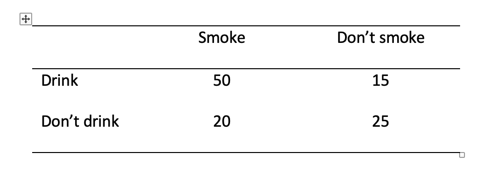

---
output:
  html_document: default
  pdf_document: default
---

# Week 14: Chi-square

> Written by Margriet Groen (partly adapted from materials developed by the PsyTeachR team a the University of Glasgow)

This week we will focus on Chi-square as a measure of association between categorical variables.

## Lectures
The lecture material for this week is presented in two parts:

1. [**Associations between categorical variables (~23 min)**](https://web.microsoftstream.com/video/bbf4a074-41b7-493e-b1d2-078fe9c442ab) 

2. [**How to do Chi-square in R (~19 min)**](https://web.microsoftstream.com/video/3735ac4c-9ba4-4a88-9acd-f949ebbc14f6) You can find the example script in this week's zip-folder (see under Pre-lab activity 3).

## Reading
The reading that accompanies the topic this week is **Chapter 20: Chi-square** from the following textbook: Greene, J. and D’Oliveira, M (2006). Learning to Use Statistical Tests in Psychology (3rd Edition). Maidenhead, UK: Open University Press.

This text is available as an e-book in the Lancaster University library through [**this link**](https://onesearch.lancaster-university.uk/permalink/f/q4m1ia/44LAN_ALMA_DS51144300650001221).

**Chapter 20** provides an accessible overview of Chi-square.

## Pre-lab activities
After having watched the lectures and read the textbook chapter you’ll be in a good position to try these activities. Completing them before you attend your lab session will help you to consolidate your learning and help move through the lab activities more smoothly.

### Pre-lab activity 1: Calculating Chi-square by hand and interpreting the results

Is there a relationship between the number of people who smoke and the number of people who drink? Please note that the question is the number of people (frequency) and not how much people drink/smoke. Alos not that these are fictitious data. You'll need a table of critical values for Chi-square. This can be found in the ‘Week 14 – resources’ folder on Moodle.

Pre-lab activity questions:

1. Complete the Pearson’s Chi-square test by hand using the data above and fill in the blanks:

**$\chi 2$ (  , *N* =   ) =      , *p*** 

2. Can you reject the null hypothesis? 

### Pre-lab activity 2: Data visualisation - practice with `ggplot2()`
In this week's online tutorials, you will practise creating bar chars, a device for visualising the distribution of categorical variables.

If you’re ready to begin, go to the tutorial linked to below. There is no need to install or download anything. Each tutorial has everything you need to write and run R code, right in the tutorial.

* [**Bar Charts**](https://rstudio.cloud/learn/primers/3.2) In this tutorial you will learn how to make and enhance bar charts with the `ggplot2` package.

### Pre-lab activity 3: Getting ready for the lab class

#### Get your files ready
Download the [122_week14_forStudents.zip](files/week14/122_week14_forStudents.zip) file and upload it into the new folder in RStudio Server you created (see week 12 Pre-lab activity 4 for instructions on how to do that).

## Lab activities
In this lab, you’ll gain understanding of and practice with:

*	conducting Pearson's Chi-square in R
* interpreting Pearson's Chi-square in R
* reporting the results in APA format
* when and why to apply Pearson's Chi-square to answer questions in psychological science

### Lab activity 1
TO FOLLOW EARLY NEXT WEEK

### Lab activity 2
TO FOLLOW EARLY NEXT WEEK

## Answers

When you have completed all of the lab content, you may want to check your answers with our completed version of the script for this week. **Remember**, looking at this script (studying/revising it) does not replace the process of working through the lab activities, trying them out for yourself, getting stuck, asking questions, finding solutions, adding your own comments, etc. **Actively engaging** with the material is the way to learn these analysis skills, not by looking at someone else's completed code...

The answers to the questions and the script containing the code will be available after the final lab session has taken place.
